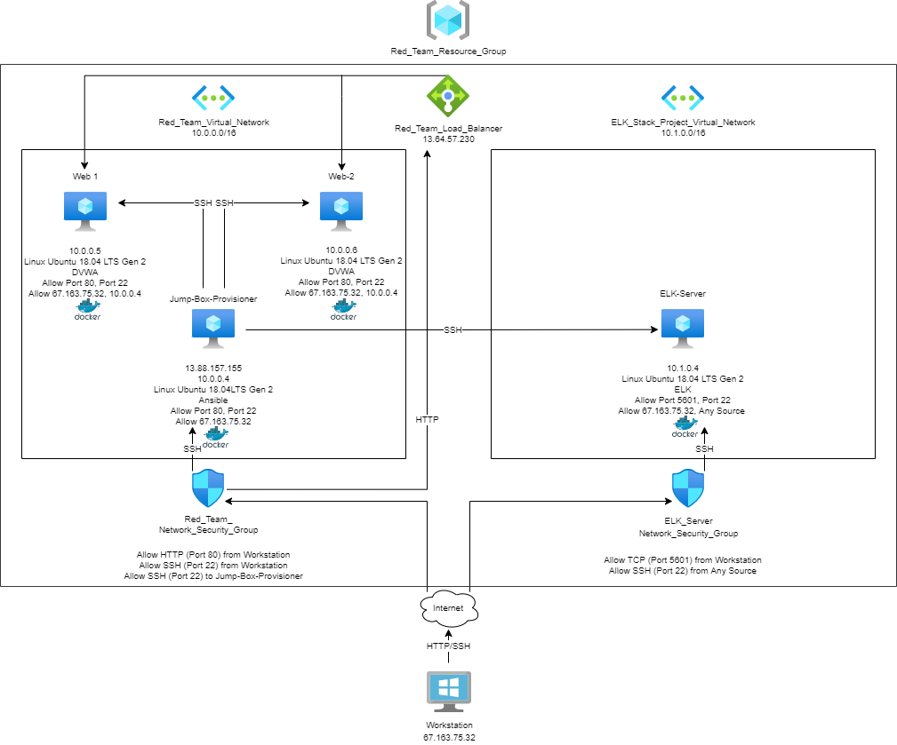
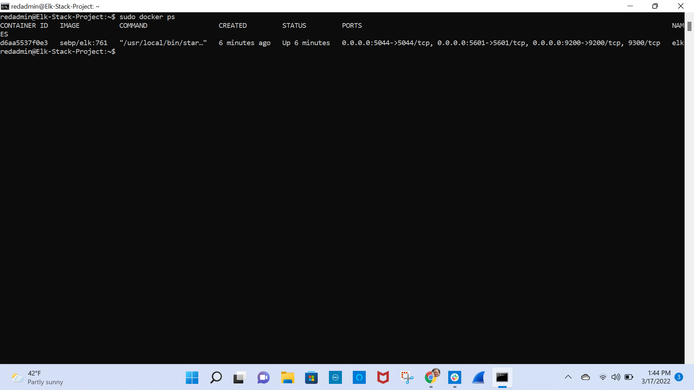

# Elasticsearch Logstash Kibana (ELK) Stack Project

## Automated ELK Stack Deployment

The files in this repository were used to configure the network depicted below:

The files listed below have been tested and used to generate a live ELK Stack deployment on Microsoft Azure. They can be used to either recreate the entire deployment pictured above, or alternatively, select files may be used to install only certain pieces of it.

- [ELK Playbook](Ansible/install-elk.yml)

- [Filebeat Playbook](Ansible/filebeat-playbook.yml)
 
- [Metricbeat Playbook](/Ansible/metricbeat-playbook.yml)

This document contains the following details:
- Description of the Topology
- Access Policies
- ELK Configuration
  - Beats in Use
  - Machines Being Monitored
- How to Use the Ansible Build

### Description of the Topology

The main purpose of this network is to expose a load-balanced and monitored instance of Damn Vulnerable Web Application (DVWA). Load balancing ensures that the application will be highly available, in addition to restricting access to the network. Load balancers distribute web traffic across web servers to prevent Denial of Service (DoS) attacks. The advantage of a jump box, which is in this network, is that it only allows system administrators to access devices from a secure source.

Integrating an ELK server allows users to easily monitor the vulnerable virtual machines (VMs) for changes to the data and system logs by using Filebeat and Metricbeat. Filebeat watches for suspicious changes to files by collecting data about file systems. Metricbeat collects and records machine metrics, such as Central Processing Unit (CPU) usage and uptime.

The configuration details of each VM are in the table below:

| Name       | Function   | IP Address | Operating System |
|------------|------------|------------|------------------|
| Jump Box   | Gateway    | 10.0.0.4   | Linux            |
| Web-1      | Web Server | 10.0.0.5   | Linux            |
| Web-2      | Web Server | 10.0.0.6   | Linux            |
| ELK-Server | Elk Stack  | 10.1.0.4   | Linux            |

### Access Policies

The VMs on the internal network are not exposed to the public Internet. Only the Jump Box can accept connections from the Internet. Access to the Jump Box is only allowed from the IP address, 67.163.75.32.

The VMs, including the ELK-Server, in the network can only be accessed through Secure Shell Protocol (SSH) from the Jump Box, which has an IP address of 10.0.0.4. The access policies are in the table below:

| Name       | Publicly Accessible | Allowed IP Addresses |
|------------|---------------------|----------------------|
| Jump Box   | Yes                 | 67.163.75.32         |
| Web-1      | No                  | 10.0.0.4             |
| Web-2      | No                  | 10.0.0.4             |
| Elk-Server | No                  | 10.0.0.4             |

### ELK Configuration

Ansible was used to automate configuration of the ELK-Server. No configuration was performed manually, which is advantageous because Ansible will ensure that provisioning scripts run identically everywhere and that automated configurations will work the same every time they run, eliminating as much variability between configurations as possible.

The ELK configuration Ansible playbook implements the following tasks:

- Configures the ELK-Server to use more memory
- Installs docker.io, python3-pip, docker
- Downloads the ELK container
- Configures the ELK container with port mappings
- Starts the ELK container and enables the docker service on boot

The following screenshot displays the result of running `docker ps` after successfully configuring the ELK instance:

### Target Machines & Beats

The ELK-Server is configured to monitor the following machines:
- Web-1: 10.0.0.5
- Web-2: 10.0.0.6

The following Beats are installed on these machines:
- Filebeat
- Metricbeat

These Beats allow us to collect the following information from each machine:

- Filebeat collects data about file systems. It is used to collect log files from very specific files, such as those generated by Apache.
- Metricbeat collects machine metrics, such as uptime.

### Using the Playbook

In order to use the playbook, you will need to have an Ansible control node already configured. Assuming you have such a control node provisioned, SSH into the control node and follow the steps below:

- Copy the Filebeat configuration file (filebeat-config.yml) and Metricbeat configuration file (metricbeat-confg.yml) to the /etc/ansible/files directory in the Ansible container.
- Update the Filebeat and Metricbeat configuration files to include:
  - output.elasticsearch:
    - hosts: [“10.1.0.4:9200”]
    - username: “elastic”
    - password: “changeme”
  - setup.kibana
    - host: “10.1.0.4:5601”
- Copy the Filebeat playbook file (filebeat-playbook.yml) and Metricbeat playbook file (metricbeat-playbook.yml) to the /etc/ansible/roles directory in the Ansible container.
- Run the Filebeat and Metricbeat playbooks, and then navigate to http://20.230.203.126:5601/app/kibana to confirm that the installation worked as expected.

Update the hosts file in the /etc/ansible directory to make Ansible run the playbooks on specific machines. The section titled "elk" specifies machines to install the ELK-Server on and the section titled "webservers" specifies machines to install Filebeat and Metricbeat on. Then, specify "elk" or "webservers" in the corresponding playbooks.
