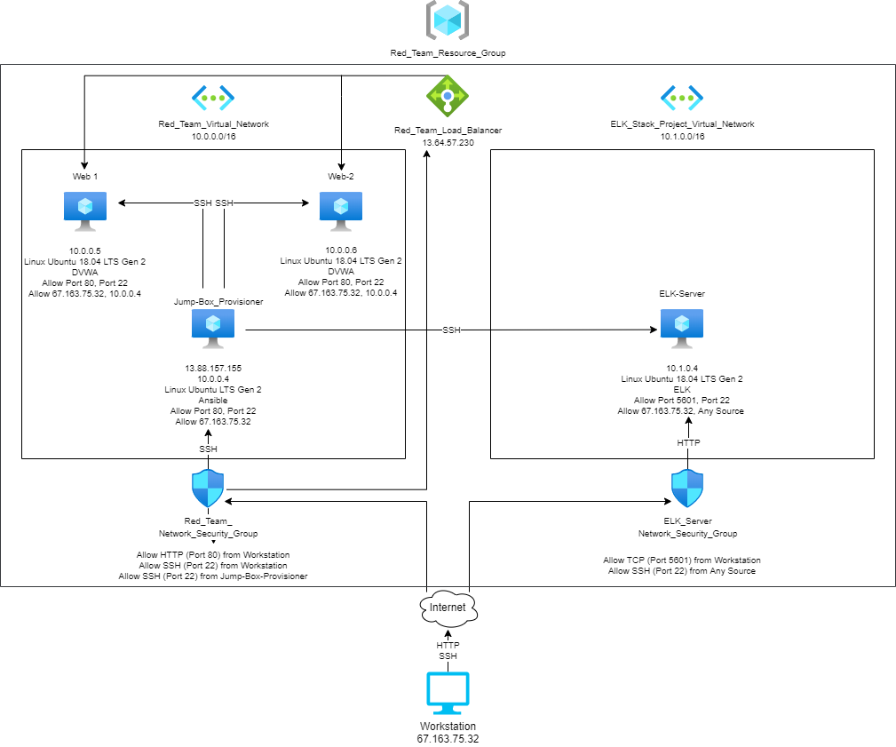

# Cybersecurity-Bootcamp
## Automated ELK Stack Deployment
The files in this repository were used to configure the network depicted below.

These files have been tested and used to generate a live ELK deployment on Microsoft Azure. They can be used to either recreate the entire deployment pictured above, or alternatively, select YAML (.yml) files may be used to install only certain pieces of it.

-	
-	
-	

This document contains the following details:
- Description of the Topology
- Access Policies
- ELK Configuration
  - Beats in Use
  - Machines Being Monitored
- How to Use the Ansible Build
### Description of the Topology
The main purpose of this network is to expose a load-balanced and monitored instance of Damn Vulnerable Web Application (DVWA)
Load balancing ensures that the application will be highly available, in addition to restricting access to the network.
- What aspect of security do load balancers protect? What is the advantage of a jump box? Load balancers protect web servers from Denial of Service (DoS) attacks. The advantage of a jump box is that it only allows system administrators to access devices from a secure source.
Integrating an ELK server allows users to easily monitor the vulnerable virtual machines (VMs) for changes to the data and system logs.
- What does Filebeat watch for? Filebeat watches for suspicious changes to files by collecting data about file systems.
- What does Metricbeat record? Metricbeat collects and records machine metrics, such as Central Processing Unit (CPU) usage and uptime.
The configuration details of each machine may be found below.

| Name       | Function   | IP Address | Operating System |
|------------|------------|------------|------------------|
| Jump Box   | Gateway    | 10.0.0.4   | Linux            |
| Web-1      | Web Server | 10.0.0.5   | Linux            |
| Web-2      | Web Server | 10.0.0.6   | Linux            |
| Elk-Server | Elk Stack  | 10.1.0.4   | Linux            | 
### Access Policies
The machines on the internal network are not exposed to the public Internet. 
Only the Jump Box machine can accept connections from the Internet. Access to this machine is only allowed from the following IP address:
- 67.163.75.32
Machines within the network can only be accessed by Secure Shell Protocol (SSH) from the Jump Box.
- Which machine did you allow to access your ELK VM? What was its IP address? I allowed my Jump Box machine to access my ELK VM. It’s IP address is 10.0.0.4.
A summary of the access policies in place can be found in the table below.

| Name       | Publicly Accessible | Allowed IP Addresses |
|------------|---------------------|----------------------|
| Jump Box   | Yes                 | 67.163.75.32         |
| Web-1      | No                  | 10.0.0.4             |
| Web-2      | No                  | 10.0.0.4             |
| Elk-Server | No                  | 10.0.0.4             |
### Elk Configuration
Ansible was used to automate configuration of the ELK machine. No configuration was performed manually, which is advantageous because...
- What is the main advantage of automating configuration with Ansible? The main advantage of automating configuration with Ansible is that it will ensure that provisioning scripts run identically everywhere and that automated configurations will do exactly the same thing every time they run, eliminating as much variability between configurations as possible.
The playbook implements the following tasks:
- Configure the ELK VM to use more memory
- Install docker.io, python3-pip, docker
- Download the ELK container
- Configure the ELK container with port mappings
- Start the ELK container and enable the docker service on boot
The following screenshot displays the result of running `docker ps` after successfully configuring the ELK instance.
- Images/docker_ps_output.png
### Target Machines & Beats
This ELK server is configured to monitor the following machines:
- Web-1: 10.0.0.5
- Web-2: 10.0.0.6

I have installed the following Beats on these machines:
- Filebeat
- Metricbeat

These Beats allow us to collect the following information from each machine:

- Filebeat collects data about file systems. It is used to collect log files from very specific files, such as those generated by Apache.
- Metricbeat collects machine metrics, such as uptime.
### Using the Playbook
In order to use the playbook, you will need to have an Ansible control node already configured. Assuming you have such a control node provisioned: 
SSH into the control node and follow the steps below:
- Copy the Filebeat configuration file (filebeat-config.yml) and Metricbeat configuration file (metricbeat-confg.yml) to the Ansible container (/etc/ansible/files).
- Update the Filebeat and Metricbeat configuration files to include:
- output.elasticsearch:
hosts: [“10.1.0.4:9200”]
username: “elastic”
password: “changeme”
-setup.kibana
host: “10.1.0.4:5601” 
- Run the playbook and navigate to http://20.230.203.126:5601/app/kibana to check that the installation worked as expected.
- Answer the following questions to fill in the blanks:
- Which file is the playbook? The playbook for Filebeat is filebeat-playbook.yml and the playbook for Metricbeat is metricbeat-playbook.yml.
- Where do you copy it? Copy the playbook files to /etc/ansible/roles.
- _Which file do you update to make Ansible run the playbooks on a specific machine? Update the hosts file in /etc/ansible. 
- How do I specify which machine to install the ELK server on versus which to install Filebeat and Metricbeat on? In the hosts file, [elk] specifies the machine to install the ELK server on and [webservers] specifies the machines to install Filebeat and Metricbeat on. Then, specify “elk” or “webservers” in the corresponding playbooks. 

